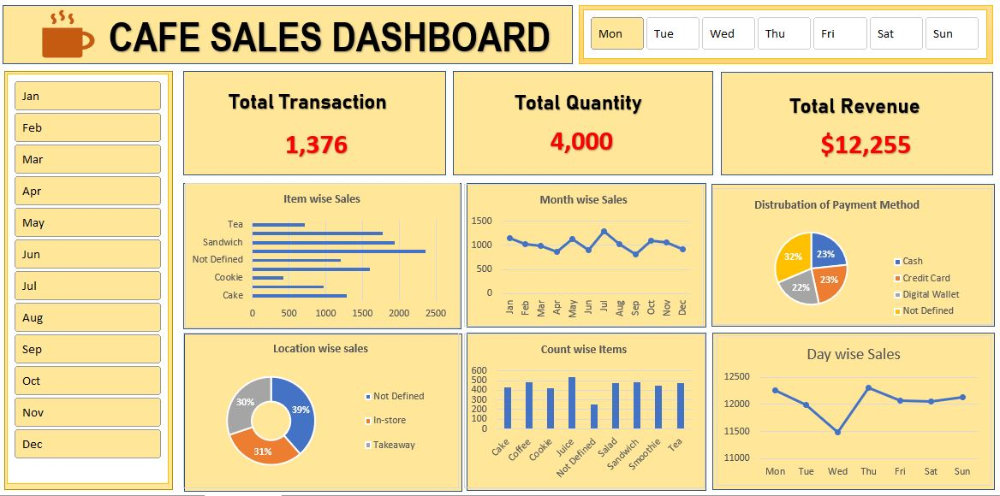

# ☕ Cafe Sales Dashboard | Excel Project

## 📌 Project Overview
This project is an **Excel-based Cafe Sales Dashboard** created to analyze cafe sales performance using interactive visuals and KPIs.  
It helps in understanding **revenue trends, item performance, customer behavior, and payment preferences**.

---

## 🎯 Objective
- Analyze cafe sales data
- Track total revenue, quantity sold, and transactions
- Identify best-selling items
- Understand month-wise and day-wise sales trends
- Analyze payment method and location distribution

---

## 📊 Key KPIs
- Total Transactions
- Total Quantity Sold
- Total Revenue

---

## 📈 Dashboard Features
- Month-wise slicer (Jan–Dec)
- Day-wise filter (Mon–Sun)
- Interactive KPIs
- Dynamic charts using Pivot Tables
- Clean and business-friendly dashboard design

---

## 📌 Visualizations Included
- Item-wise Sales (Bar Chart)
- Month-wise Sales Trend (Line Chart)
- Day-wise Sales Trend (Line Chart)
- Payment Method Distribution (Pie Chart)
- Location-wise Sales (Donut Chart)
- Item Count Analysis (Column Chart)

---

## 🛠 Tools & Skills Used
- Microsoft Excel
- Pivot Tables & Pivot Charts
- Excel Slicers
- Data Cleaning & Formatting
- Excel Functions:
  - SUM
  - COUNT
  - IF
  - VLOOKUP / XLOOKUP
- Dashboard Design & Data Visualization

---

## 📂 Dataset Description
The dataset contains the following fields:
- Transaction Date
- Item Name
- Quantity Sold
- Revenue
- Payment Method (Cash, Credit Card, Digital Wallet)
- Sales Location (In-store / Takeaway)

---

## 📊 Business Insights
- Higher sales observed during weekends
- Digital Wallet and Credit Card payments are most used
- Coffee and Sandwich are top-selling items
- Seasonal variation visible in month-wise sales

---

## 🚀 How to Use
1. Download the Excel file
2. Enable editing
3. Use Month and Day slicers to filter data
4. Analyze KPIs and charts dynamically

---
## 📷 Dashboard Preview

---

## 👤 Author
**Ankush Kumar**  
📧 Email: ankushkr804@gmail.com  
🔗 GitHub: https://github.com/ankushkr1211

---

⭐ *If you found this project useful, feel free to star the repository!*
